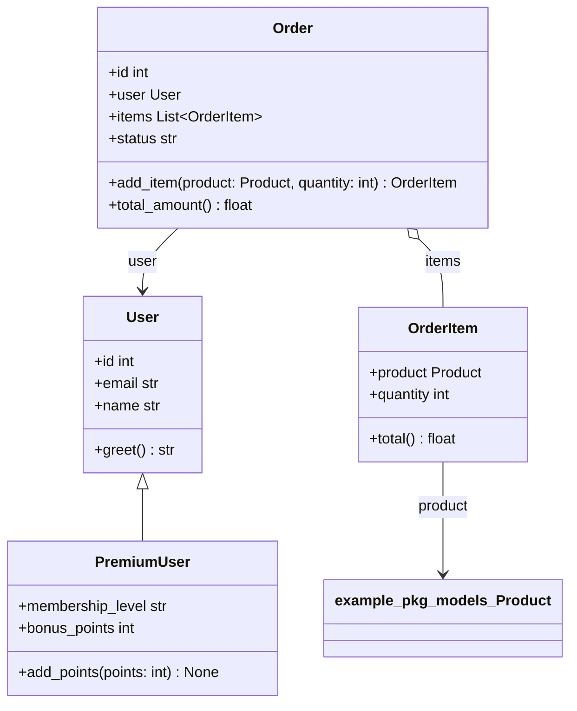

# gendoc — Pipeline de documentation graphique automatique pour Python

> **Générez automatiquement une documentation visuelle synchronisée avec votre code source, sans intervention manuelle.**

`gendoc` analyse votre package Python via AST/statique, produit :

- 📊 **Diagrammes de classes UML** en Mermaid **et** PlantUML (héritage, composition, agrégation, association, dépendance, attributs typés, classes imbriquées, fonctions de module)
- 📦 **Diagrammes de packages** avec dépendances internes (style pydeps) et **détection de cycles en rouge**
- 🎯 **Diagrammes ciblés** `--focus MaClasse --depth 2`
- 📚 **Site MkDocs Material** avec docstrings Google → mkdocstrings, Mermaid natif
- 🎨 SVG (fallback pur Python), PNG optionnel, `.mmd` / `.puml` éditables
- 🔁 **Sorties déterministes** (mêmes diagrammes d'un run à l'autre) et **mode tolérant** : un fichier non parsable est signalé (`PackageInfo.errors`) sans faire échouer le build (`strict=True` pour l'ancien comportement)

100% local, open-source, aucun service cloud.

---

## 🚀 Quickstart

### Installation

```bash
# librairie seule (analyse + diagrammes) — cœur léger
pip install -e .
# avec la génération de site MkDocs
pip install -e ".[site]"
# optionnel pour conversion PNG
pip install -e ".[svg]"
# tout
pip install -e ".[all]"
```

Python ≥ 3.11 requis.

### Utilisation — 1 commande

```bash
# Depuis la racine de votre projet Python
gendoc build ./mon_package

# Le site est généré dans ./site et sources markdown dans ./docs
# Pour servir en local :
gendoc serve
# → http://127.0.0.1:8000
```

C'est le critère d'acceptation : `gendoc build ./mon_package` produit un site navigable avec :

- 1 diagramme de packages
- 1 diagramme de classes par module
- doc API complète

### Exemple sur le projet fourni

```bash
gendoc build ./example/example_pkg --output ./site --site-name "Demo gendoc"
gendoc serve
```

### Options CLI

```bash
gendoc build --help

# Filtrage (chaque flag booléen a sa forme inverse pour surcharger le TOML)
gendoc build ./pkg --exclude "test_*" --public-only --no-include-private

# Diagramme ciblé
gendoc build ./pkg --focus Order --depth 2

# Formats
gendoc build ./pkg --formats mmd,puml,svg,png

# Config custom
gendoc build ./pkg --config gendoc.toml -o ./site --site-name "Mon Site"

# Vérif CI (échoue si code non analysable)
gendoc check ./pkg

# Génère seulement diagrammes (sans site)
gendoc diagram ./pkg --output ./diagrams --format all

# Régénère les docs puis les sert avec rechargement auto (nécessite [site])
gendoc serve ./pkg --port 8000

# Init config exemple
gendoc init
```

### Configuration via `gendoc.toml`

Créez `gendoc.toml` ou utilisez `[tool.gendoc]` dans `pyproject.toml` :

```toml
[gendoc]
package_path = "src/mon_package"
package_name = "mon_package"
output_dir = "site"
docs_dir = "docs"
formats = ["mmd", "puml", "svg"]
exclude_patterns = ["test_*", "*_test.py", "tests", "__pycache__"]
include_private = false
public_only = false
site_name = "Mon Package"
# focus_class = "MaClasse"
# focus_depth = 2
```

La CLI surcharge le fichier TOML — uniquement pour les options explicitement passées
(un argument absent laisse la valeur du TOML intacte, y compris `package_path`).

---

## 🧩 Fonctionnalités détaillées

### 1. Diagrammes de classes UML

- Analyse AST (réutilise concepts pyreverse/py2puml mais implémente son propre parseur pour performance <60s pour 50k lignes)
- Détection :
  - Attributs typés (`x: int`, `self.y: MyClass`, `List[Product]`, unions `X | None`), classes imbriquées (`Outer.Inner`), méthodes `async`, paramètres positional-only, fonctions de module
  - Méthodes avec signatures, décorateurs `@staticmethod`, `@classmethod`, `@property`, `@abstractmethod`
  - Visibilité `+ public`, `- private`, `# protected`
  - Héritage `<|--`, composition `*--` (instance construite dans `__init__`), agrégation `o--` (collections `list[X]`…), association `-->` (référence stockée), dépendance `..>` (paramètres/retours)
  - Les classes homonymes de modules différents restent des nœuds distincts (identifiants qualifiés)
- Sorties :
  - `diagrams/<module>.mmd` (Mermaid), `.puml` (PlantUML)
  - SVG généré en fallback pur Python (pas besoin de Graphviz, mais compatible si présent pour PNG via cairosvg/inkscape)

### 2. Diagrammes de packages

- Graphe des imports internes
- Détection cycles via DFS → coloration rouge en Mermaid et SVG
- Styles pydeps
- `diagrams/package.mmd|puml|svg`

### 3. Diagrammes ciblés

```bash
gendoc build ./pkg --focus Order --depth 2
# Génère docs/focus.md + diagrams/focus_Order.mmd/svg/puml
# BFS à partir de Order, 2 niveaux
```

### 4. Documentation API

- Extraction docstrings Google style via `mkdocstrings[python]`
- Génère `docs/api/<module>.md` avec :

```markdown
::: mon_package.module.Classe
```

- MkDocs Material + `pymdownx.superfences` pour rendu Mermaid natif

### 5. Filtrage

- `--exclude`, `exclude_patterns` en TOML — les patterns matchent des **segments de chemin**
  (fnmatch), jamais des sous-chaînes : `tests` exclut `tests/`, pas `attestation.py`
- `--include-private/--no-include-private` : classes et fonctions préfixées par `_`
  (les classes publiques d'un module `_interne.py` restent documentées)
- `--public-only/--no-public-only` pour n'afficher que les membres publics

### 6. Formats

- `.mmd` Mermaid éditable (génériques rendus `List~Product~`)
- `.puml` PlantUML éditable
- `.svg` fallback pur Python (troncatures signalées par `…`)
- `.png` si `cairosvg` ou `inkscape` dispo

---

## 📁 Structure du site généré

```text
docs/
  index.md              # Vue d'ensemble + diagramme package + diagramme global
  packages.md           # Détails dépendances
  diagrams.md           # Liste des sources de diagrammes (liée dans la nav)
  focus.md              # Si --focus
  modules/
    mon_package_module.md  # 1 par module, avec diagramme Mermaid intégré
  api/
    mon_package_module.md  # API via mkdocstrings
  diagrams/
    package.mmd|puml|svg|png
    mon_package_module.mmd|puml|svg
mkdocs.yml              # Généré (marqueur en tête) ; un mkdocs.yml à vous n'est jamais écrasé
site/                   # HTML final (après mkdocs build)
```

---

## 🔄 Intégration CI — GitHub Actions

Workflow fourni : [`.github/workflows/ci.yml`](.github/workflows/ci.yml)

- **lint** : `ruff check` + `mypy` ;
- **test** : `pytest` avec couverture ≥ 80 %, matrice Python 3.11 / 3.12 / 3.13 ;
- **docs** : `gendoc check` sur le package d'exemple (échoue si code non analysable),
  `gendoc build`, et publication du site généré en artifact.

Pour déployer sur GitHub Pages, ajoutez à la suite du job `docs` :

```yaml
- uses: actions/upload-pages-artifact@v3
  with:
    path: site/
- uses: actions/deploy-pages@v4
```

Activez Pages : Settings → Pages → Source → GitHub Actions.

---

## 📚 Utilisation comme librairie Python

`gendoc` est aussi une librairie, pas seulement une CLI :

```python
import gendoc

# 1. Analyse
pkg = gendoc.analyze_package("./mon_package")
print(f"{len(pkg.classes)} classes, {len(pkg.modules)} modules")
print(f"Cycles: {pkg.circular_dependencies}")

# 2. API haut niveau
docs_path = gendoc.build_docs(
    "./mon_package",
    output_dir="./site",
    docs_dir="./docs",
    formats=["mmd", "puml", "svg"],
    site_name="Ma Doc",
    public_only=False,
    focus_class="Order",  # optionnel
    focus_depth=2,
)

# 3. Diagrammes en mémoire (pour notebook, autre outil)
diags = gendoc.get_diagrams("./mon_package", diagram_format="mermaid")
print(diags["package"])  # flowchart TD ...
print(diags["classes"])  # classDiagram ...

# Focus
focus = gendoc.get_diagrams("./mon_package", "mermaid", focus_class="User", depth=1)
print(focus["focus_User"])

# 4. Check CI
if gendoc.check_package("./mon_package"):
    print("OK analysable")

# 5. Config objet
cfg = gendoc.GendocConfig(
    package_path="src/mon_pkg",
    output_dir="site",
    public_only=True,
    exclude_patterns=["test_*"],
)
gendoc.build_docs_with_config(cfg)

# 6. Quick overview
print(gendoc.quick_overview("./example/example_pkg"))
```

Exemple complet : `example/library_usage.py`

```bash
python example/library_usage.py
```

Intégration dans votre propre outil :

```python
def my_tool(pkg_path):
    pkg = gendoc.analyze(pkg_path)
    return {
        "classes": [c.qualified_name for c in pkg.classes.values()],
        "circular": pkg.circular_dependencies,
    }
```

---

## 🧪 Tests & couverture

```bash
pip install -e ".[dev]"
pytest                                        # fonctionne tel quel
pytest --cov=gendoc --cov-report=term-missing # couverture (exigée ≥80% en CI)
pytest tests/test_analyzer.py -v
```

Tests sur `example_pkg` et packages temporaires :

- `test_analyzer.py` / `test_ast_parser.py` : parsing (classes imbriquées, async, posonly…), imports relatifs, exclusions, mode tolérant
- `test_relationships.py` : héritage/composition/agrégation/association, homonymes, cycles, déterminisme
- `test_renderers.py` : Mermaid, PlantUML, SVG (syntaxe, homonymes, arêtes circulaires exactes)
- `test_builder.py` : génération site (liens d'images, nav, mkdocs.yml protégé)
- `test_cli.py` : CLI end-to-end (précédence TOML/CLI incluse)
- `test_config.py` : TOML (validation, valeurs limites)
- `test_e2e_example.py` : pipeline complet sur `example/example_pkg` + déterminisme inter-processus

---

## 🏗️ Architecture

```text
src/gendoc/
  analyzer/
    ast_parser.py      # AST → ClassInfo, ModuleInfo (une passe par fichier)
    package_analyzer.py # collecte modules, dépendances
    relationships.py   # relations + cycles + focus BFS
    models.py          # dataclasses
  renderers/
    mermaid.py         # classDiagram
    plantuml.py
    package_mermaid.py # flowchart + package diagram
    svg.py             # SVG fallback pur python
  builder/
    site_builder.py    # Jinja2 → MkDocs
  config.py            # TOML + recherche auto
  cli.py               # Click + Rich
```

- Réutilise **concepts** pyreverse : analyse statique par AST plutôt que réécrire parseur complexe ; fallback Graphviz optionnel pour PNG
- Pas de service cloud
- Cœur léger (`click`, `rich`, `jinja2`) — la pile MkDocs est optionnelle via l'extra `[site]`

---

## 🎬 Démo

L'exemple `example/example_pkg` contient :

- `models.py` : `User`, `PremiumUser(User)`, `Product`, `OrderItem`, `Order`
  (association `Order --> User`, agrégation `Order o-- OrderItem` via `items: List[OrderItem]`,
  association `OrderItem --> Product`)
- `services.py` : `UserService` (agrégation `o-- User`), `OrderService` (association `--> UserService`)
- `utils.py` : fonctions de module (`format_price`, `validate_email`, …) documentées
- `circular_a.py ↔ circular_b.py` : cycle détecté → **rouge**

Lancer :

```bash
gendoc build ./example/example_pkg
```

Extrait réel du diagramme du module `models` (les nœuds portent un identifiant
qualifié pour distinguer d'éventuels homonymes, avec le nom court en label) :



---

## 📦 Contraintes respectées

- Python ≥3.11, `pyproject.toml`, `pip install -e .`
- Config `gendoc.toml` + CLI
- CI GitHub Actions (lint, tests multi-versions, build docs), `gendoc check` échoue si non analysable
- Performance <60s pour 50k lignes (AST pur, une seule passe de parsing par fichier)
- Réutilise pyreverse inspiration, Graphviz optionnel, fallback Mermaid pur
- Local 100% open-source

---

## 📝 TODO / Améliorations

- Rendu PNG via `mmdc` (Mermaid CLI) si Node dispo
- Support `pyreverse` en option `--use-pyreverse` pour comparer
- Rebuild automatique des diagrammes quand les sources changent (`gendoc serve` relance
  aujourd'hui MkDocs en watch sur les markdown générés, pas sur le code source)

---

## Licence

MIT
