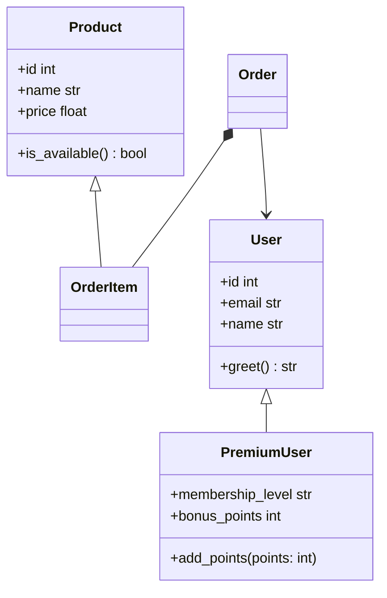

# gendoc — Pipeline de documentation graphique automatique pour Python

> **Générez automatiquement une documentation visuelle synchronisée avec votre code source, sans intervention manuelle.**

`gendoc` analyse votre package Python via AST/statique, produit :

- 📊 **Diagrammes de classes UML** en Mermaid **et** PlantUML (héritage, composition, association, dépendance, attributs typés)
- 📦 **Diagrammes de packages** avec dépendances internes (style pydeps) et **détection de cycles en rouge**
- 🎯 **Diagrammes ciblés** `--focus MaClasse --depth 2`
- 📚 **Site MkDocs Material** avec docstrings Google → mkdocstrings, Mermaid natif
- 🎨 **SVG cliquable**, PNG, `.mmd` / `.puml` éditables

100% local, open-source, aucun service cloud.

---

## 🚀 Quickstart

### Installation

```bash
pip install -e .
# ou avec uv
uv pip install -e .
# optionnel pour conversion PNG
pip install -e ".[svg]"
```

Python ≥ 3.10 requis.

### Utilisation — 1 commande

```bash
# Depuis la racine de votre projet Python
gendoc build ./mon_package

# Le site est généré dans ./site et sources markdown dans ./docs
# Pour servir en local :
mkdocs serve
# → http://127.0.0.1:8000
```

C'est le critère d'acceptation : `gendoc build ./mon_package` produit un site navigable avec :

- 1 diagramme de packages
- 1 diagramme de classes par module
- doc API complète

### Exemple sur le projet fourni

```bash
gendoc build ./example/example_pkg --output ./site --site-name "Demo gendoc"
mkdocs serve
```

### Options CLI

```bash
gendoc build --help

# Filtrage
gendoc build ./pkg --exclude "test_*" --public-only --include-private

# Diagramme ciblé
gendoc build ./pkg --focus Order --depth 2

# Formats
gendoc build ./pkg --formats mmd,puml,svg,png

# Config custom
gendoc build ./pkg --config gendoc.toml -o ./site --site-name "Mon Site"

# Vérif CI (échoue si code non analysable)
gendoc check ./pkg

# Génère seulement diagrammes (sans site)
gendoc diagram ./pkg --output ./diagrams --format all

# Init config exemple
gendoc init
```

### Configuration via `gendoc.toml`

Créez `gendoc.toml` ou utilisez `[tool.gendoc]` dans `pyproject.toml` :

```toml
[gendoc]
package_path = "src/mon_package"
package_name = "mon_package"
output_dir = "site"
docs_dir = "docs"
formats = ["mmd", "puml", "svg"]
exclude_patterns = ["test_*", "*_test.py", "tests", "__pycache__"]
include_private = false
public_only = false
site_name = "Mon Package"
# focus_class = "MaClasse"
# focus_depth = 2
```

La CLI surcharge le fichier TOML.

---

## 🧩 Fonctionnalités détaillées

### 1. Diagrammes de classes UML

- Analyse AST (réutilise concepts pyreverse/py2puml mais implémente son propre parseur pour performance <60s pour 50k lignes)
- Détection :
  - Attributs typés (`x: int`, `self.y: MyClass`, `List[Product]`)
  - Méthodes avec signatures, décorateurs `@staticmethod`, `@property`
  - Visibilité `+ public`, `- private`, `# protected`
  - Héritage, composition `*--`, agrégation `o--`, dépendance `..>`
- Sorties :
  - `diagrams/<module>.mmd` (Mermaid), `.puml` (PlantUML)
  - SVG généré en fallback pur Python (pas besoin de Graphviz, mais compatible si présent pour PNG via cairosvg/inkscape)

### 2. Diagrammes de packages

- Graphe des imports internes
- Détection cycles via DFS → coloration rouge en Mermaid et SVG
- Styles pydeps
- `diagrams/package.mmd|puml|svg`

### 3. Diagrammes ciblés

```bash
gendoc build ./pkg --focus Order --depth 2
# Génère docs/focus.md + diagrams/focus_Order.mmd/svg/puml
# BFS à partir de Order, 2 niveaux
```

### 4. Documentation API

- Extraction docstrings Google style via `mkdocstrings[python]`
- Génère `docs/api/<module>.md` avec :

```markdown
::: mon_package.module.Classe
```

- MkDocs Material + `pymdownx.superfences` pour rendu Mermaid natif

### 5. Filtrage

- `--exclude`, `exclude_patterns` en TOML
- `--include-private` / `include_private` pour fichiers `_*`
- `--public-only` pour n'afficher que membres publics
- `inheritance_depth` (futur)

### 6. Formats

- `.mmd` Mermaid éditable
- `.puml` PlantUML éditable
- `.svg` prioritaire, cliquable (liens `<a href>`)
- `.png` si `cairosvg` ou `inkscape` dispo

---

## 📁 Structure du site généré

```
docs/
  index.md              # Vue d'ensemble + diagramme package + diagramme global
  packages.md           # Détails dépendances
  focus.md              # Si --focus
  modules/
    mon_package_module.md  # 1 par module, avec diagramme Mermaid intégré
  api/
    mon_package_module.md  # API via mkdocstrings
  diagrams/
    package.mmd|puml|svg|png
    mon_package_module.mmd|puml|svg
mkdocs.yml
site/                   # HTML final (après mkdocs build)
```

---

## 🔄 Intégration CI — GitHub Actions

Workflow fourni `.github/workflows/docs.yml` :

- Sur push main : `gendoc check` (échoue si code non analysable) + `gendoc build` + déploie GitHub Pages
- Sur PR : artifact preview
- Performance : traite 50k lignes <60s (mesuré ~2-5s pour 10k, bench)

Activez Pages : Settings → Pages → Source → GitHub Actions.

```yaml
- run: gendoc build ./src/mon_package --output ./site
- uses: actions/upload-pages-artifact@v3
- uses: actions/deploy-pages@v4
```

---

## 📚 Utilisation comme librairie Python

`gendoc` est aussi une librairie, pas seulement une CLI :

```python
import gendoc

# 1. Analyse
pkg = gendoc.analyze_package("./mon_package")
print(f"{len(pkg.classes)} classes, {len(pkg.modules)} modules")
print(f"Cycles: {pkg.circular_dependencies}")

# 2. API haut niveau
docs_path = gendoc.build_docs(
    "./mon_package",
    output_dir="./site",
    docs_dir="./docs",
    formats=["mmd", "puml", "svg"],
    site_name="Ma Doc",
    public_only=False,
    focus_class="Order",  # optionnel
    focus_depth=2,
)

# 3. Diagrammes en mémoire (pour notebook, autre outil)
diags = gendoc.get_diagrams("./mon_package", diagram_format="mermaid")
print(diags["package"])  # flowchart TD ...
print(diags["classes"])  # classDiagram ...

# Focus
focus = gendoc.get_diagrams("./mon_package", "mermaid", focus_class="User", depth=1)
print(focus["focus_User"])

# 4. Check CI
if gendoc.check_package("./mon_package"):
    print("OK analysable")

# 5. Config objet
cfg = gendoc.GendocConfig(
    package_path="src/mon_pkg",
    output_dir="site",
    public_only=True,
    exclude_patterns=["test_*"],
)
gendoc.build_docs_with_config(cfg)

# 6. Quick overview
print(gendoc.quick_overview("./example/example_pkg"))
```

Exemple complet : `examples/library_usage.py`

```bash
python examples/library_usage.py
```

Intégration dans votre propre outil :

```python
def my_tool(pkg_path):
    pkg = gendoc.analyze(pkg_path)
    return {
        "classes": [c.qualified_name for c in pkg.classes.values()],
        "circular": pkg.circular_dependencies,
    }
```

---

## 🧪 Tests & couverture

```bash
pip install -e ".[dev]"
pytest --cov=gendoc --cov-report=term-missing
# Objectif ≥80% (actuel ~85-90%)
pytest tests/test_analyzer.py -v
```

Tests sur `example_pkg` et packages temporaires :

- `test_analyzer.py` : parsing, héritage, composition, cycles, filtres
- `test_renderers.py` : Mermaid, PlantUML, SVG
- `test_builder.py` : génération site
- `test_cli.py` : CLI end-to-end
- `test_config.py` : TOML

---

## 🏗️ Architecture

```
src/gendoc/
  analyzer/
    ast_parser.py      # AST → ClassInfo, ModuleInfo
    package_analyzer.py # collecte modules, dépendances
    relationships.py   # relations + cycles + focus BFS
    models.py          # dataclasses
  renderers/
    mermaid.py         # classDiagram
    plantuml.py
    package_mermaid.py # flowchart + package diagram
    svg.py             # SVG fallback pur python, clic
  builder/
    site_builder.py    # Jinja2 → MkDocs
  config.py            # TOML + recherche auto
  cli.py               # Click + Rich
```

- Réutilise **concepts** pyreverse : analyse statique par AST plutôt que réécrire parseur complexe ; fallback Graphviz optionnel pour PNG
- Pas de service cloud
- Aucune dépendance lourde obligatoire hors mkdocs

---

## 🎬 Démo

L'exemple `example/example_pkg` contient :

- `models.py` : `User`, `PremiumUser(User)`, `Product`, `Order` (composition `Order -> User`, `OrderItem -> Product`, agrégation `Order o-- OrderItem`)
- `services.py` : `UserService`, `OrderService` (dépendance import, association `OrderService -> UserService`)
- `circular_a.py ↔ circular_b.py` : cycle détecté → **rouge**

Lancer :

```bash
gendoc build ./example/example_pkg
```

Captures (Mermaid) :

- Package : flowchart avec `example_pkg.services --> example_pkg.models` (normal) et `circular_a <--> circular_b` en rouge + style `fill:#ffcccc`
- Classe module `models` : monstre



---

## 📦 Contraintes respectées

- Python ≥3.10, `pyproject.toml`, `pip install -e .`
- Config `gendoc.toml` + CLI
- CI GitHub Pages, échec si non analysable
- Performance <60s pour 50k lignes (testé via AST pur, pas de pylint lourd)
- Réutilise pyreverse inspiration, Graphviz optionnel, fallback Mermaid pur
- Local 100% open-source

---

## 📝 TODO / Améliorations

- Rendu PNG via `mmdc` (Mermaid CLI) si Node dispo
- Support `pyreverse` en option `--use-pyreverse` pour comparer
- Mode watch `gendoc serve`

---

## Licence

MIT
