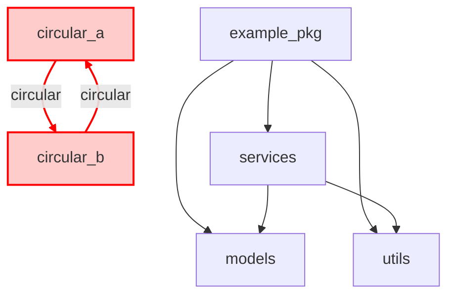
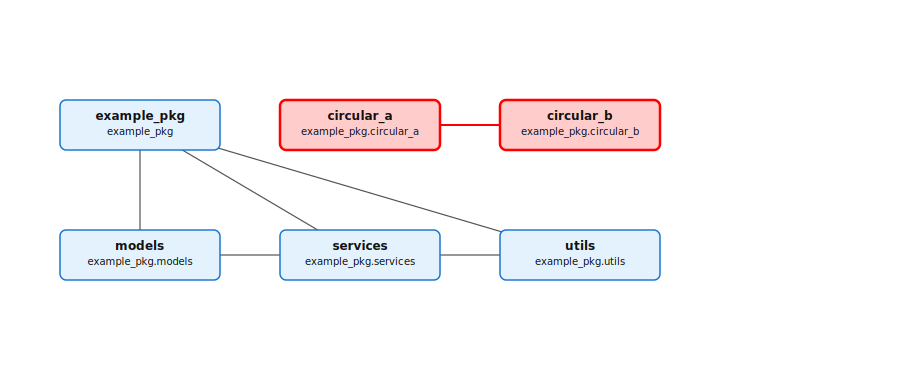
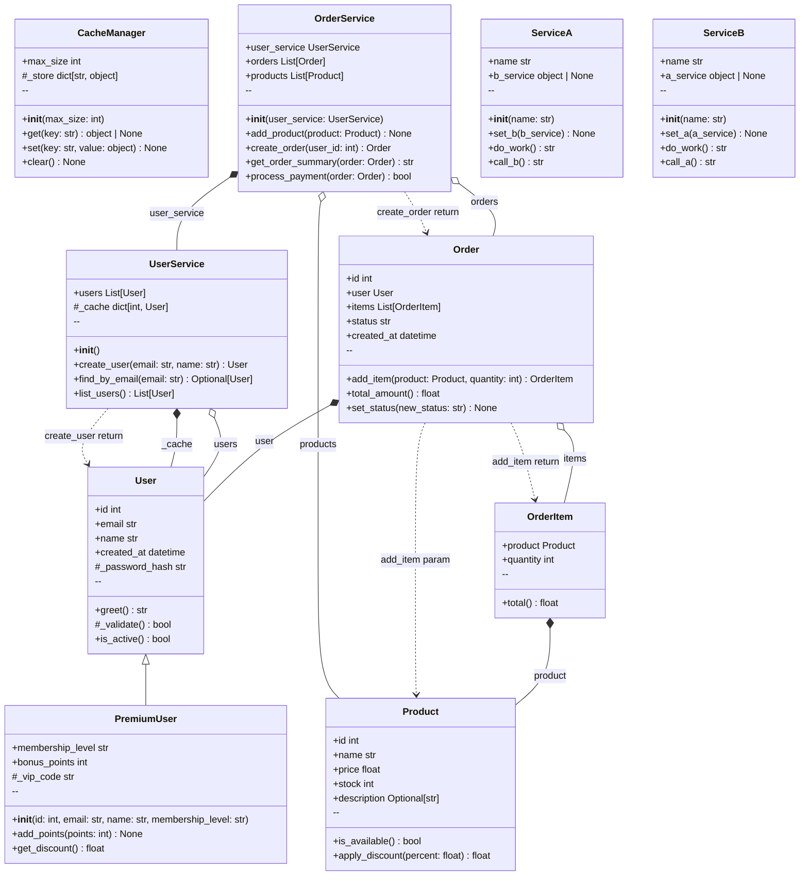

# example_pkg - Documentation

> Généré automatiquement par **gendoc** le 2026-07-14 12:23

## Vue d'ensemble

- **Modules :** 6
- **Classes :** 10
- **Relations :** 13

!!! warning "Dépendances circulaires détectées"
    Le projet contient 1 cycle(s) de dépendances circulaires :

    
    - `example_pkg.circular_a -> example_pkg.circular_b -> example_pkg.circular_a`
    

## Diagramme de packages

Structure et dépendances internes (circulaires en rouge).

## Diagrammes de classes

### Diagramme global

## Navigation

- [Structure détaillée des packages](packages.md)
- [Modules](modules/)
- [API Reference](api/)

---

*Documentation générée avec gendoc - 100% local, open-source*