# Module `example_pkg`

> Fichier: `/home/user/visual-doc/example/example_pkg/__init__.py`

## Classes (0)


## Diagramme de classes

```mermaid
classDiagram
    %% Module example_pkg
```


### PlantUML

```plantuml
@startuml
title Module example_pkg
skinparam classAttributeIconSize 0
skinparam classFontStyle bold
hide empty members
@enduml
```



## Détails API

Voir [API example_pkg](../api/example_pkg.md)

## Imports

- **Internes :** .models, .services, .utils
- **Externes :** aucun

## Code source

```python
# /home/user/visual-doc/example/example_pkg/__init__.py
```