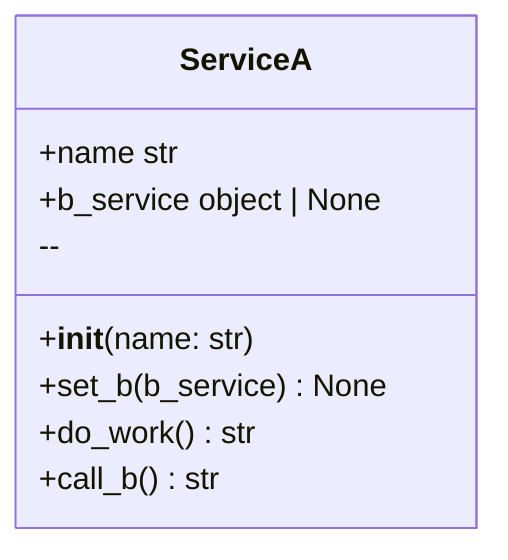
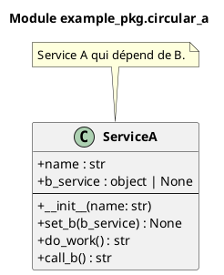

# Module `example_pkg.circular_a`

> Fichier: `/home/user/visual-doc/example/example_pkg/circular_a.py`

## Classes (1)


- **ServiceA** 


## Diagramme de classes




### PlantUML



## Détails API

Voir [API example_pkg.circular_a](../api/example_pkg_circular_a.md)

## Imports

- **Internes :** .circular_b, circular_b
- **Externes :** __future__

## Code source

```python
# /home/user/visual-doc/example/example_pkg/circular_a.py
```