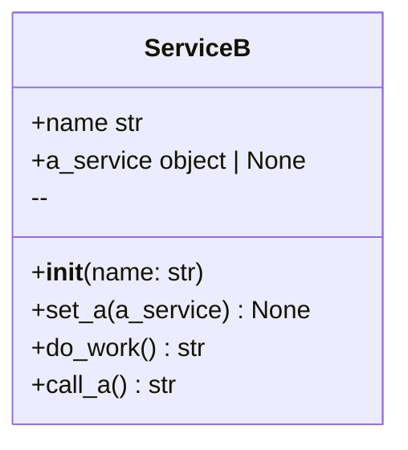
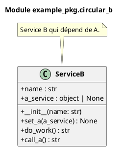

# Module `example_pkg.circular_b`

> Fichier: `/home/user/visual-doc/example/example_pkg/circular_b.py`

## Classes (1)


- **ServiceB** 


## Diagramme de classes




### PlantUML



## Détails API

Voir [API example_pkg.circular_b](../api/example_pkg_circular_b.md)

## Imports

- **Internes :** .circular_a, circular_a
- **Externes :** __future__

## Code source

```python
# /home/user/visual-doc/example/example_pkg/circular_b.py
```