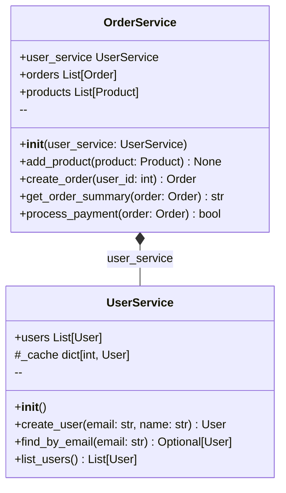
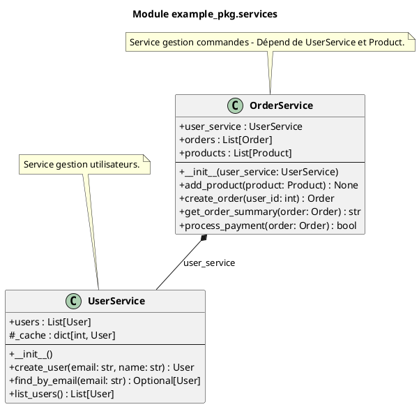

# Module `example_pkg.services`

> Fichier: `/home/user/visual-doc/example/example_pkg/services.py`

## Classes (2)


- **UserService** 

- **OrderService** 


## Diagramme de classes




### PlantUML



## Détails API

Voir [API example_pkg.services](../api/example_pkg_services.md)

## Imports

- **Internes :** .models, .utils
- **Externes :** __future__, typing

## Code source

```python
# /home/user/visual-doc/example/example_pkg/services.py
```