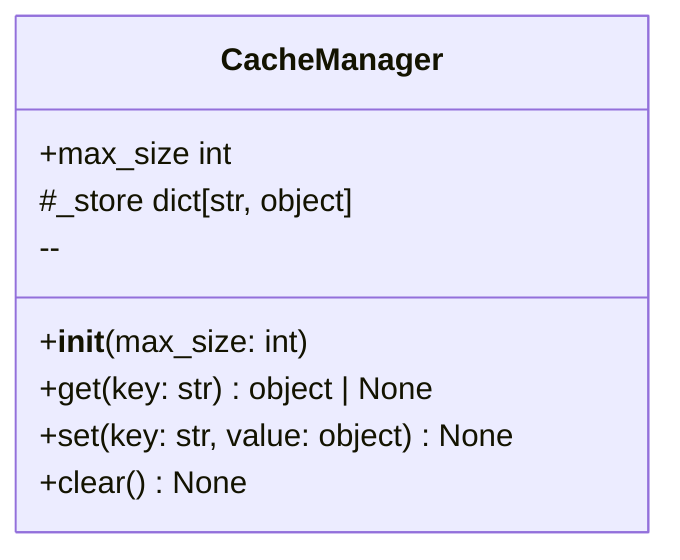
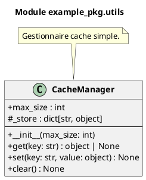

# Module `example_pkg.utils`

> Fichier: `/home/user/visual-doc/example/example_pkg/utils.py`

## Classes (1)


- **CacheManager** 


## Diagramme de classes




### PlantUML



## Détails API

Voir [API example_pkg.utils](../api/example_pkg_utils.md)

## Imports

- **Internes :** aucun
- **Externes :** __future__, re, typing

## Code source

```python
# /home/user/visual-doc/example/example_pkg/utils.py
```