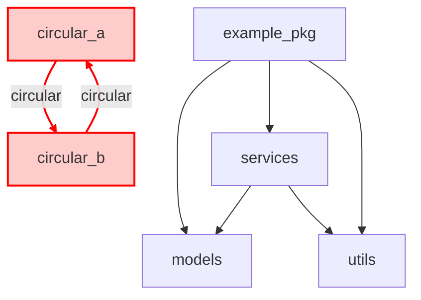

# Packages - example_pkg

# Structure du package example_pkg

Total modules: 6
Total classes: 10
Total relations: 13

## ⚠️ Dépendances circulaires détectées

1. example_pkg.circular_a -> example_pkg.circular_b -> example_pkg.circular_a

## Modules
- `example_pkg` (0 classes, 3 imports internes)
- `example_pkg.circular_a` (1 classes, 2 imports internes)
- `example_pkg.circular_b` (1 classes, 2 imports internes)
- `example_pkg.models` (5 classes, 0 imports internes)
- `example_pkg.services` (2 classes, 2 imports internes)
- `example_pkg.utils` (1 classes, 0 imports internes)

## Dépendances
- `example_pkg` dépend de: `example_pkg.models`, `example_pkg.services`, `example_pkg.utils`
- `example_pkg.circular_a` dépend de: `example_pkg.circular_b`
- `example_pkg.circular_b` dépend de: `example_pkg.circular_a`
- `example_pkg.services` dépend de: `example_pkg.models`, `example_pkg.utils`

## Diagramme de dépendances (Mermaid)



## Diagramme de dépendances (PlantUML)

```plantuml
@startuml
title Package Diagram - example_pkg
skinparam packageStyle rectangle
package example_pkg {
  [example_pkg] as example_pkg
  [example_pkg.circular_a] as example_pkg_circular_a
  [example_pkg.circular_b] as example_pkg_circular_b
  [example_pkg.models] as example_pkg_models
  [example_pkg.services] as example_pkg_services
  [example_pkg.utils] as example_pkg_utils
}
example_pkg ..> example_pkg_models
example_pkg ..> example_pkg_services
example_pkg ..> example_pkg_utils
example_pkg_services ..> example_pkg_models
example_pkg_services ..> example_pkg_utils
example_pkg_circular_a ..> example_pkg_circular_b #red : circular
example_pkg_circular_b ..> example_pkg_circular_a #red : circular
@enduml
```

## SVG

